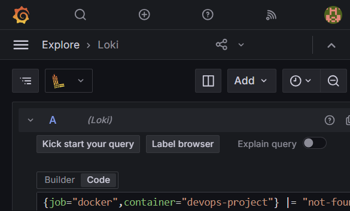

# DevOps Intern Final Assessment

[](https://github.com/MSCloudDev/devops-intern-final/actions/workflows/ci.yml)

**Name:** Mahmoud Shams
**Assessment date:** 2026-09-14

This repository contains a small NGINX website, a Docker image, GitHub Actions CI, a Nomad job, and a Loki monitoring stack.

## Architecture

```text
source code -> GitHub Actions -> GHCR image -> Nomad + Consul -> Docker logs -> Promtail -> Loki -> Grafana
```

## Prerequisites

- Docker Desktop 4.70.0 or newer
- Docker Engine 29.4.0 or newer
- Nomad 2.0.6
- Consul 2.0.4
- ShellCheck 0.10.x
- Git

## Quick Start

```bash
git clone https://github.com/MSCloudDev/devops-intern-final.git
cd devops-intern-final
docker build --build-arg BUILD_SHA=local-test -t devops-project:test ./app
docker run --rm -d --name devops-project -p 8080:8080 devops-project:test
bash scripts/healthcheck.sh http://localhost:8080/healthz
docker compose -f monitoring/docker-compose.yaml up -d
```

The site is available at http://localhost:8080. Grafana is available at http://localhost:3000.

## Task 1: Source Control

Work was developed in feature branches and merged to `main`. The final state is tagged `v1.0.0`:

```bash
git checkout main
git pull --ff-only
git show --no-patch --decorate v1.0.0
```

The repository history contains small conventional commits such as `docs: organize repo structure` and a merged pull request.

## Task 2: Linux Scripts

Both scripts use `set -euo pipefail` and are tracked as executable files.

```bash
shellcheck scripts/*.sh
bash scripts/sysinfo.sh
bash scripts/healthcheck.sh http://localhost:8080/healthz
```

Example health check output:

```text
Health check OK: http://localhost:8080/healthz returned HTTP 200
```

`sysinfo.sh` prints the user and UID, hostname, kernel, ISO-8601 date, disk usage, memory usage, and Docker daemon status.

## Task 3: Containerisation

The image uses the pinned `nginx:1.27-alpine` base image, listens on port 8080, runs as `nginx`, and has a Docker health check. `BUILD_SHA` is written into the HTML page during the build.

```bash
docker build --build-arg BUILD_SHA=local-test -t devops-project:test ./app
docker run --rm -d --name devops-project -p 8080:8080 devops-project:test
curl -i http://localhost:8080/
curl -i http://localhost:8080/healthz
docker images devops-project:test
```

Observed locally on 2026-09-14:

```text
HTTP/1.1 200 OK
Build SHA: local-test
HTTP/1.1 200 OK
OK
Image size: 20,980,771 bytes (about 20.9 MB)
```

## Task 4: Continuous Integration

`.github/workflows/ci.yml` runs on pushes and pull requests to `main`.

- `lint` runs ShellCheck and Hadolint.
- `build` builds the image with the Git commit SHA.
- `test` starts the image and runs `scripts/healthcheck.sh`.
- `publish` runs only after a push to `main` and pushes both the SHA tag and `latest` to GHCR.

The workflow uses `GITHUB_TOKEN` with `packages: write` only in the publish job.

## Task 5: Nomad

Start a local Nomad and Consul development agent, then validate and plan the job:

```bash
nomad job validate -var="image_tag=latest" nomad/nginx-app.nomad.hcl
nomad job plan -var="image_tag=latest" nomad/nginx-app.nomad.hcl
nomad job run -var="image_tag=latest" nomad/nginx-app.nomad.hcl
nomad job status nginx-app
```

The job uses one service group and one Docker task, allocates 100 MHz and 64 MB, maps a dynamic `http` port to container port 8080, registers an HTTP Consul check, and enables rolling updates, restart, and reschedule policies.

Validation was run locally with Nomad 2.0.6 and completed successfully. A healthy allocation requires a Linux Nomad client with the Docker driver enabled; the native Windows client reports the Linux Docker driver as unhealthy.

Observed with Nomad 2.0.6 in WSL2 on 2026-09-14:

```text
nomad job plan: All tasks successfully allocated
nomad job run: Job registration successful
Allocation: df158fd4-c41b-ba43-730c-8580fa652c9f
Status: running
Dynamic port: 31787 -> 8080
HTTP /healthz: 200 OK
Consul nginx-health: passing (HTTP GET /healthz: 200 OK)
```

## Task 6: Loki Monitoring

Start Loki, Promtail, and Grafana:

```bash
docker compose -f monitoring/docker-compose.yaml up -d
curl -i http://localhost:8080/missing-page
```

Open Grafana at http://localhost:3000 and add Loki as a data source with URL `http://loki:3100`. In Explore, a useful query is:

```logql
{job="docker", service="nginx-app"} |~ " 404 | 500 "
```

The Promtail labels are `job`, `container`, and `service`. The complete setup notes are in [monitoring/loki_setup.md](monitoring/loki_setup.md).



## Troubleshooting

1. **Port 8080 is already in use:** stop the old container with `docker rm -f devops-project`, or use another host port such as `-p 8081:8080`.
2. **The page shows `BUILD_SHA_PLACEHOLDER`:** rebuild the image with `--build-arg BUILD_SHA=...`; the value is inserted during `docker build`.
3. **Nomad allocation is unhealthy:** check `nomad alloc status <allocation-id>` and confirm that the allocated port reaches `/healthz` and that Consul is running.

## Known Limitations

- GHCR publishing requires the GitHub repository package settings to allow `GITHUB_TOKEN` to write packages.
- The local monitoring setup uses Docker discovery. Nomad production logs would be better shipped directly from a Nomad client or a dedicated logging agent.
- TLS, secrets management, persistent Grafana configuration, and high availability are not included.